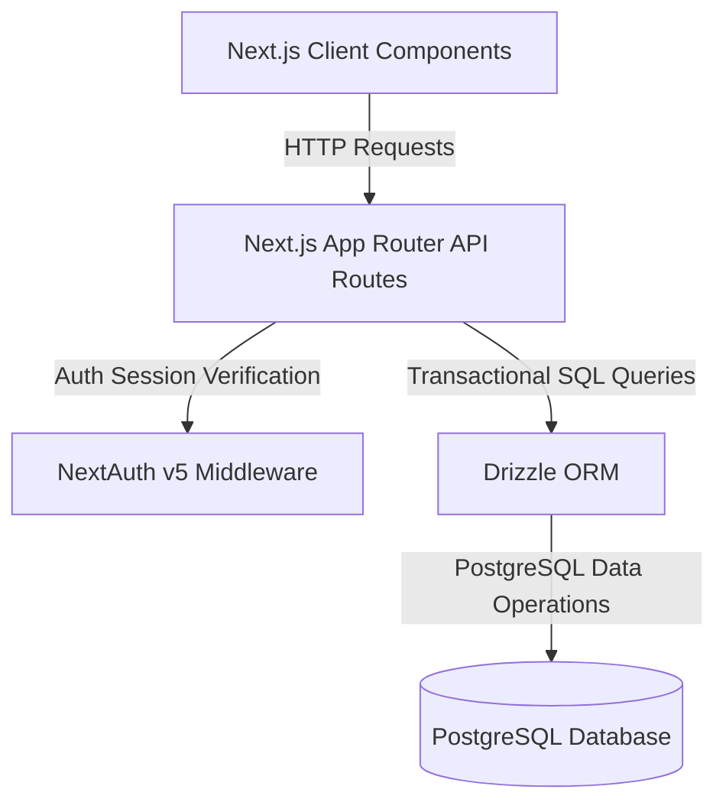
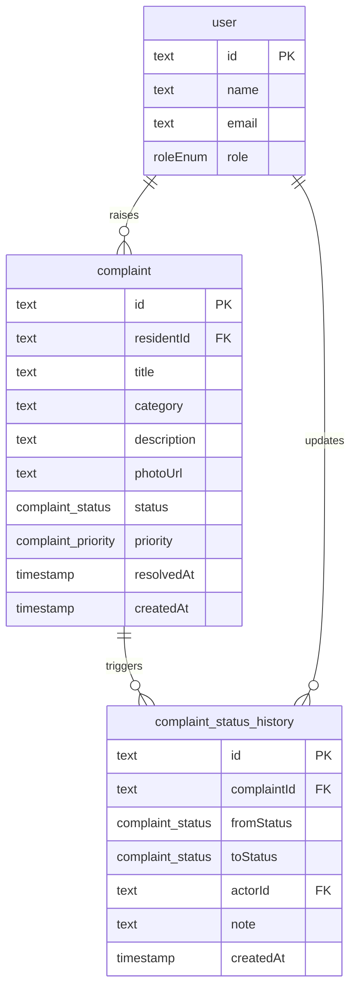

# System Design - Society Maintenance Tracker

This document provides a technical write-up of the Society Maintenance Tracker architecture, data model patterns, and lifecycle models.

---

## 1. System Architecture

The Society Maintenance Tracker is designed using Next.js App Router, combining Server-Side Rendering (SSR) for layouts and Client-Side dynamic interactive components (React Hooks + fetch) for responsive updates. 



* **Frontend**: Next.js Server Components for layout shells (to leverage caching and streaming layout renders) with nested Client Components (`use client`) for real-time status transitions, inline updates, and dashboard widgets.
* **Authentication**: NextAuth.js v5 using JSON Web Tokens (JWT) for session management. User roles (`UserRole`) are embedded in the JWT payload to enable efficient role checks at the Edge middleware level, avoiding duplicate database queries.
* **Database & ORM**: PostgreSQL database powered by Neon. Schema definitions and migrations are managed using Drizzle ORM. Drizzle acts as a lightweight query builder providing type safety at compile time.

---

## 2. Complaint History Model

Audit trails are a core requirement of this application. While the current status and priority of a complaint reside directly on the `complaint` record, every status transition is recorded in the append-only `complaint_status_history` table.

### Relational Schema Diagram



### Transaction Management
To prevent race conditions, the update of a complaint status and the insertion into the history log are executed transactionally. If either operation fails, the entire transaction is rolled back:

```typescript
// Transactional execution block in status transition service
await db.transaction(async (tx) => {
    // 1. Update the complaint record
    await tx.update(complaintsTable)
        .set({ status: toStatus, resolvedAt })
        .where(eq(complaintsTable.id, complaintId));

    // 2. Log status change history
    await tx.insert(complaintStatusHistoryTable)
        .values({
            complaintId,
            fromStatus: currentStatus,
            toStatus,
            actorId,
            note
        });
});
```

---

## 3. Overdue Detection Model

To avoid database drift and index overhead, **overdue status is computed dynamically** at query time rather than being stored as a static field.

* **Threshold Configuration**: Stored in `app_settings` (`overdueThresholdDays`, default `7` days).
* **Formula**: A complaint is considered overdue if it is not resolved (`status != 'RESOLVED'`) and its creation timestamp is older than the configured threshold:
  $$\text{Current Date} - \text{createdAt} > \text{overdueThresholdDays}$$
* **Database Query Implementation**:
  ```typescript
  const cutoff = new Date(Date.now() - overdueThresholdDays * 24 * 60 * 60 * 1000);
  const overdueComplaints = await db
      .select()
      .from(complaintsTable)
      .where(
          and(
              ne(complaintsTable.status, 'RESOLVED'),
              lt(complaintsTable.createdAt, cutoff)
          )
      );
  ```

---

## 4. Photo Handling

For the Minimum Viable Product, photos are linked via simple URL strings (`photoUrl` in the `complaint` table):
* Submitting a complaint accepts a public image link.
* **Database Type**: Text (nullable), which stores the full absolute HTTP/S address of the image resource.
* **Future Extension**: Integrate an uploads route mapping files directly to an S3-compatible object storage container or Cloudinary API, returning the secure asset URL to store in the database.

---

## 5. Notification Flow

The application schema includes an `email_log` table to audit outbound communications.

* **Database Type**: Enums track status updates (`STATUS_CHANGE`) and notices (`IMPORTANT_NOTICE`).
* **Implementation Plan**: In production, status changes or notice creations trigger async background jobs. The job initiates an API request via a transactional email provider (such as Resend) and logs a record to `email_log` with status (`SENT` or `FAILED`).

---

## 6. Scalability and Future Extensions

1. **Async Workers**: Defer heavy operations like email routing and photo transformations into background workers using message brokers (e.g. BullMQ, RabbitMQ) to keep API endpoints fast and responsive.
2. **Database Sharding/Partitioning**: As complaint logs scale, partition the `complaint` and `complaint_status_history` tables chronologically (e.g., yearly) to optimize query execution and index sizes.
